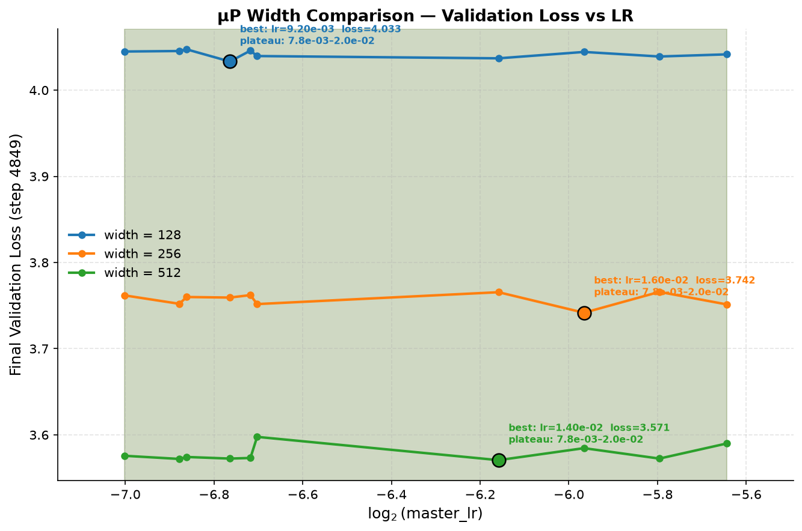
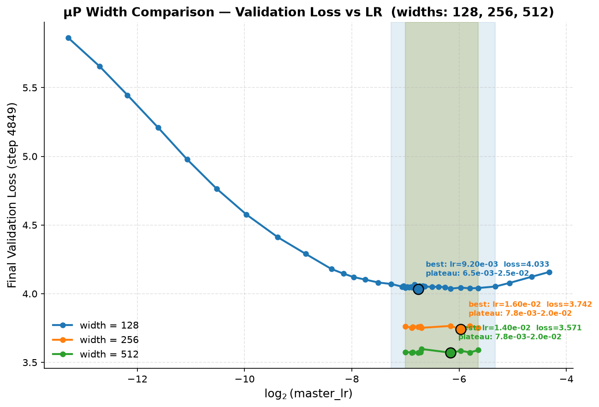
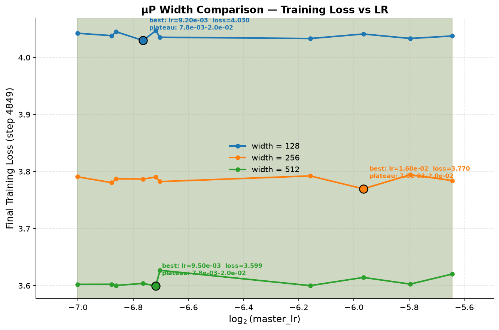
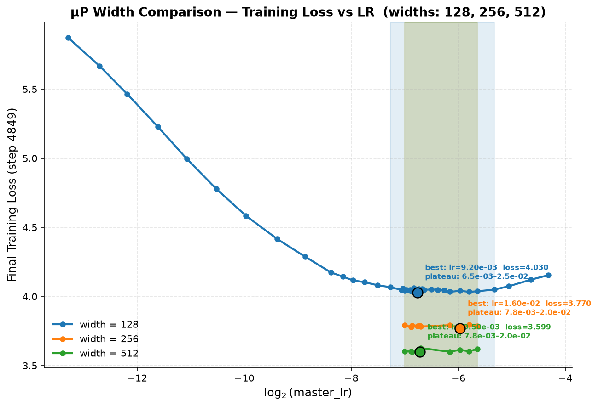
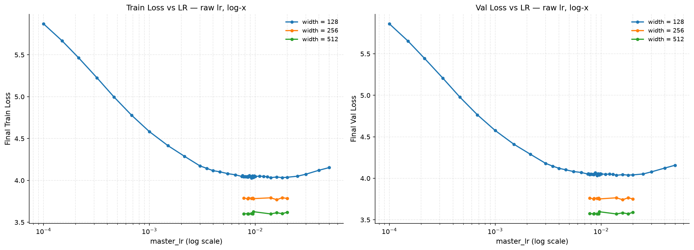

# muP GPT — Maximal Update Parametrization on Wikitext-103

A clean implementation of [muP (Maximal Update Parametrization)](https://arxiv.org/abs/2203.03466)
on top of a GPT-2 style language model, trained on the Wikitext-103 dataset.
The goal is to verify that hyperparameters (especially learning rate) transfer
across model widths — tune once at small width, deploy at any width.

---

## What is muP?

Standard neural network parametrization causes optimal hyperparameters to shift
as you scale model width. muP fixes this by adjusting three things:

- **Attention scaling**: `1/d_head` instead of `1/sqrt(d_head)`
- **Weight initialization**: std scaled by `1/sqrt(width_multiplier)` for hidden layers
- **Per-layer learning rate**: hidden weights get lr scaled by `1/width_multiplier`

The result: a hyperparameter sweep done at base width transfers directly to 2x, 4x, 8x width models.

---

## Files

| File | Description |
|---|---|
| `model.py` | GPT model with muP modifications clearly marked |
| `train.py` | Training loop with muP config, coord check logging, CSV/wandb logging |
| `bin_con.py` | Preprocesses raw wikitext-103 into tokenized `.bin` files |
| `configurator.py` | CLI config override utility |
| `csv_logging.py` | Lightweight CSV logger with optional wandb wrapper |

---

## muP Implementation Details

All muP changes in `model.py` are marked with `### Begin muP code ###` / `### End muP code ###`.

### 1. Attention Scaling
```python
# muP: 1/d_head instead of 1/sqrt(d_head)
attention_scale = 1.0 / k.size(-1)
```

### 2. Weight Initialization
```python
# Hidden weights scaled by 1/sqrt(width_multiplier)
torch.nn.init.normal_(p, std=init_std / math.sqrt(mup_width_multiplier))
```

### 3. Per-Layer Learning Rate (applied in train.py)
```python
# Applied every iteration in the optimizer loop
param_group['lr'] = lr * param_group.get('lr_scale', 1.0)
# lr_scale = 1/width_multiplier for hidden weights, 1.0 for everything else
```

### 4. Input / Output Multipliers
```python
x *= mup_input_alpha                              # after embedding
x *= mup_output_alpha / mup_width_multiplier      # before lm_head
```

---

## Setup

```bash
pip install torch tiktoken numpy tqdm

# Tokenize the dataset (run once)
python bin_con.py

# Train
python train.py
```

To train at a different width while keeping the same LR:
```bash
python train.py --n_embd=512 --mup_width_multiplier=2.0
python train.py --n_embd=1024 --mup_width_multiplier=4.0
```

---

## Coordinate Check

On startup, `train.py` runs a coordinate check to verify muP is working correctly.
It trains briefly at width 1x and 2x and checks that the logit delta std is
width-invariant (ratio between 0.5 and 2.0 = PASS).
-- Coordinate Check (std of logit delta across widths) -----------
width_mult=1.0 n_embd=256 | std(delta_logit) after 10 steps = 0.03241
width_mult=2.0 n_embd=512 | std(delta_logit) after 10 steps = 0.03198
ratio (2x/1x width) = 0.987 -> PASS

---

## Results

### Validation Loss — All Widths


### Validation Loss — Zoomed Out


### Train Loss — All Widths


### Train Loss — Zoomed Out


### Diagnostic — Log X Scale


---

## Key Config Parameters

| Parameter | Default | Description |
|---|---|---|
| `mup_enabled` | `True` | Enable muP parametrization |
| `mup_width_multiplier` | `1.0` | `n_embd / base_width (256)` |
| `mup_input_alpha` | `1.0` | Tunable input embedding multiplier |
| `mup_output_alpha` | `1.0` | Tunable output unembedding multiplier |
| `mup_disable_attention_scaling` | `False` | Use standard `1/sqrt(d)` instead |
| `mup_disable_hidden_lr_scaling` | `False` | Disable per-layer LR scaling |

---

## References

- [muP paper: Tensor Programs V](https://arxiv.org/abs/2203.03466)
- [karpathy/nanoGPT](https://github.com/karpathy/nanoGPT) — base codebase
- [Wikitext-103 dataset](https://huggingface.co/datasets/Salesforce/wikitext)
